# font

**Work in Progress**

## Features

- Exact same line width
- Consistent size
- Perfect circles for all curves

## Roadmap

- [x] Finish full alphabet (A-Z and a-z)
- [ ] Make numbers (0-9)
- [ ] Make special characters
- [ ] Generate font file

## Preview

### Uppercase & Lowercase

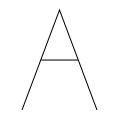 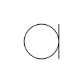

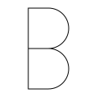 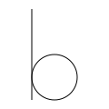

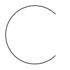 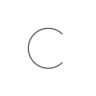

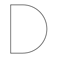 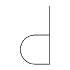

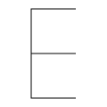 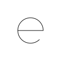

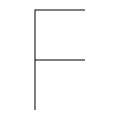 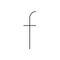

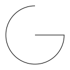 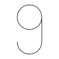

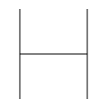 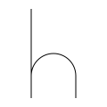

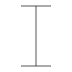 

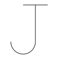 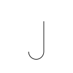

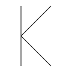 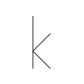

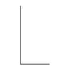 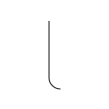

 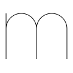

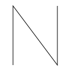 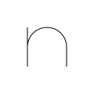

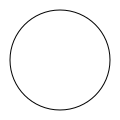 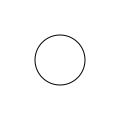

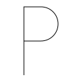 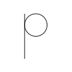

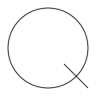 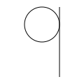

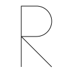 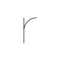

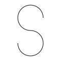 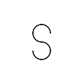

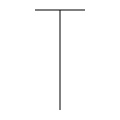 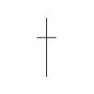

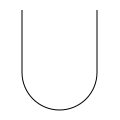 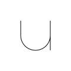

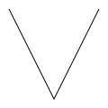 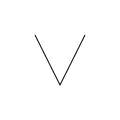

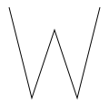 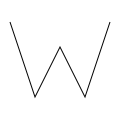

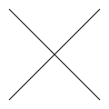 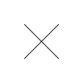

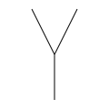 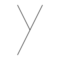

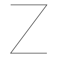 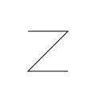

---

### Numbers

---

### Special Characters

---

# testing

                                                   
